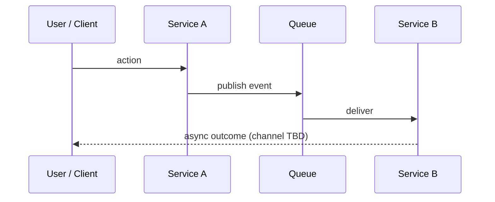
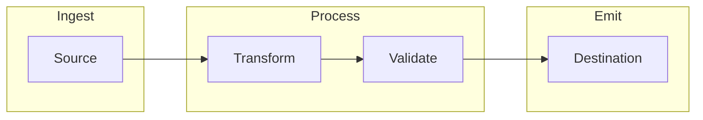
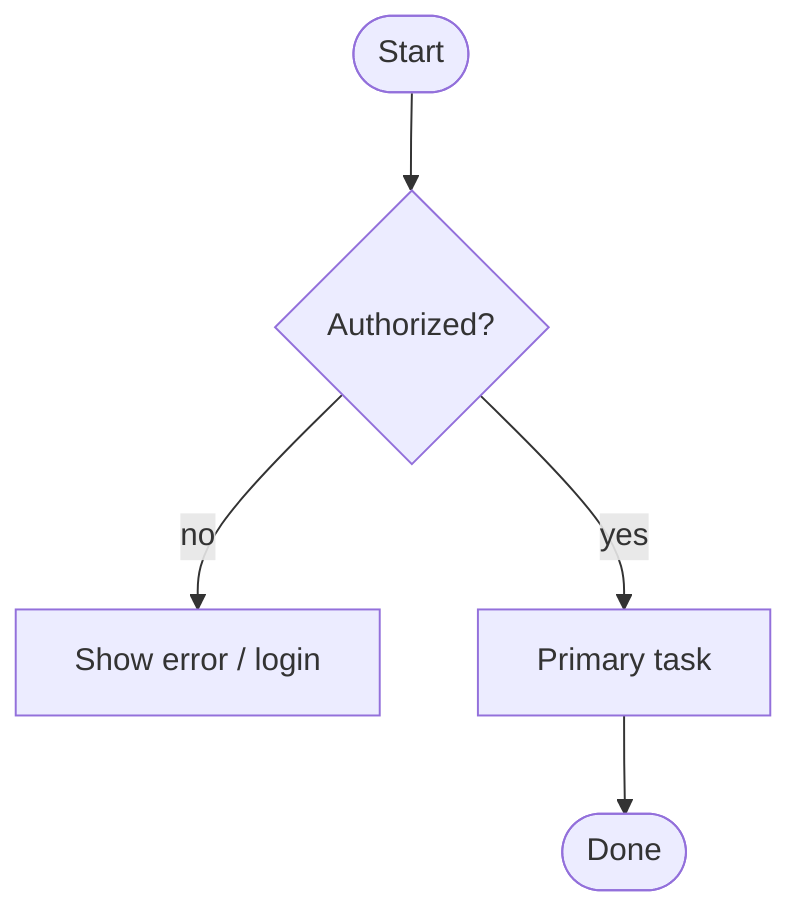

# Reference — HTML technical documents

## Source article: “Unreasonable Effectiveness of HTML”

**Author:** Thariq S. (`@trq212` on X). **Your link:** [x.com/trq212/article/2052809885763747935](https://x.com/trq212/article/2052809885763747935).

**Gallery of example HTML outputs:** [thariqs.github.io/html-effectiveness](https://thariqs.github.io/html-effectiveness/)

**Playgrounds / two-way interaction thread:** [x.com/trq212/status/2017024445244924382](https://x.com/trq212/status/2017024445244924382)

The bullets below **paraphrase** the article (no images required for the skill; the piece mentions a screenshot of Claude using Unicode to fake color in Markdown—that is illustrative only).

### Why HTML (per article)

1. **Information density** — HTML can carry structure, real tables, CSS-as-design-data, SVG illustrations, annotated code, light JS interactions, spatial layouts, images, and workflows in one surface. Without that, models may fall back to **ASCII diagrams** or **Unicode color hacks** in Markdown—readable by the model but weaker for humans.

2. **Visual clarity and navigation** — Long Markdown specs are often skimmed or abandoned past ~100 lines; HTML can organize **tabs**, **sections**, **illustrations**, and **responsive** layout so people actually read it (including on mobile).

3. **Ease of sharing** — Browsers do not render `.md` uniformly; HTML can be **opened locally** or **uploaded** (e.g. S3) and shared as a URL—higher odds colleagues read the spec, report, or PR explainer.

4. **Two-way interaction** — Sliders, knobs, and toggles let readers explore parameters; pair with **copy-out** to paste results back into Claude Code (see [Two-way interaction](#two-way-interaction-and-playgrounds)).

5. **Data ingestion (Claude Code angle)** — In-repo HTML artifacts benefit from **filesystem**, **git history**, **MCPs** (Slack, Linear, etc.), and browser context—good fit for synthesized reports and categorized diagrams.

6. **Affective goal** — The author frames HTML collaboration as **more engaging** (“joyful”) and feeling **more in the loop** than skipping long Markdown plans.

### Tradeoffs and FAQs (from article)

| Topic | Takeaway |
|--------|-----------|
| **Tokens** | HTML can use more tokens than Markdown; author argues **read/completion rate** and expressiveness outweigh raw size, especially with large context windows. |
| **When Markdown** | Author is personally “HTML maximalist”; in practice many repos still need **Markdown where diffs and conventions require it**. |
| **Viewing** | Open locally in a browser, or upload for a shareable link. |
| **Generation time** | HTML may take **2–4×** longer to generate than Markdown; accept when quality matters. |
| **Version control** | **HTML diffs are noisy** vs Markdown—honest downside for PR review of the file itself. |
| **Visual taste** | Use a **design reference** (e.g. one “design system” HTML file from the company codebase) so repeated artifacts match brand; author mentions frontend-design style help. |

### Use-case map (agent should recognize these)

- **Specs / planning / exploration** — Web of HTML explorations → mockups → implementation plan; pass files into a fresh implementation session; verification agents read the same HTML for breadth.
- **Code review / PR explainers** — Diffs, margin annotations, severity colors, flowcharts—often attached to PRs instead of relying only on GitHub’s default diff.
- **Design / prototypes** — Throwaway HTML before React/Swift/etc.; sliders for animation parameters; **export** chosen values.
- **Reports / research** — Long explainers, interactive pages, or “deck” style; SVG for diagrams; synthesize Slack + code + git + web.
- **Custom editing UIs** — Draggable triage boards, flag editors with dependency warnings, prompt side-by-side with live fill—always end with **copy as markdown / JSON / diff / prompt**.

### Relation to this skill

The article explicitly says a **`/html` skill** is optional—you can prompt from scratch. This **`bmo-document-html`** skill encodes **repeatable defaults** (semantics, a11y, Mermaid CDN pattern, Guidelines fetch) so outputs stay rigorous without re-negotiating structure each time.

---

## Why HTML (engineering summary)

Markdown optimizes for **authoring speed** and **plain-text diffs**. HTML optimizes for **reader experience** and **layout semantics** when the doc is the product:

| Dimension | Markdown | Single-file HTML |
|-----------|----------|------------------|
| **Stable presentation** | Renders differently per host (GFM, CommonMark, MDX). | You own the stylesheet. |
| **Complex tables** | Pipe tables break on wide content; alignment fragile. | Real `<table>`, column semantics, styled `th`. |
| **Diagrams** | Mermaid often needs host support or build step. | Embed SVG; or versioned Mermaid + `run()` in one page. |
| **Navigation** | TOC is auto or duplicated by hand. | TOC with in-page `#anchors`, skip link, landmarks. |
| **Theming** | Depends on host | `color-scheme`, `prefers-color-scheme` CSS variables. |
| **Print / PDF** | Hit-or-miss | `@media print` rules on the same file. |

## Diagram playbook

**Default:** pick **one primary diagram** early (overview), then add **focused** diagrams per section when complexity grows. Combine with **short prose** and **tables** for contracts—not either-or.

### Choose a diagram shape

| Intent | Prefer | Notes |
|--------|----------|------|
| **Service / queue / API topology** | Mermaid `flowchart` / `graph` **or** inline **SVG** boxes + arrows | Show named boundaries (apps, exchanges, queues); label direction of **publish** vs **consume** vs **RPC**. |
| **Request / message sequence** | Mermaid `sequenceDiagram` | One swimlane per actor; align with log lines or code paths you cite. |
| **Data flow** (transforms, pipelines) | `flowchart TD` or **layered SVG** (sources → stages → sinks) | Number stages if order matters. |
| **User journey** (UI, branches, errors) | `flowchart` with decision nodes **or** horizontal step strip in HTML/CSS | Mirror real copy for critical step names when known. |
| **State / status model** | Mermaid `stateDiagram-v2` | Pair with enum or schema names from code. |
| **Before vs after** (migration) | **Two panels** (grid or side-by-side `<figure>`) + optional third “delta” mini-diagram | Same legend keys in both panels when possible. |
| **Many similar items** (regions, flags, tenants) | **CSS grid “cards”** + color tokens from `:root` | Still a “diagram” for humans—keep density readable. |

### Mermaid starters (adapt labels)

**Services and async messages:**



**Data / control pipeline:**



**Branching user flow (simplified):**



### SVG vs Mermaid

- **SVG:** best for **pixel-stable branding**, custom icons, print, and **no JS**; more verbose to author.
- **Mermaid:** best for **iteration speed** and sequence charts; needs JS init (see section **Mermaid (ESM, deferred render)** below); keep graphs **small** so they stay legible on mobile.

### Raster images

Use `` only when the asset is **given** or **essential** (screenshot, photo). Do not rely on images alone—keep the **same facts** in text or table for accessibility and search.

## Two-way interaction and playgrounds

For interactive explainers:

1. Make controls **keyboard-accessible** where possible (native `<button>`, `<input>`, labels).
2. Provide a visible **export** action: copy JSON, YAML diff, markdown list, or “prompt block” so the artifact closes the loop back into the repo or chat.
3. Do not store secrets in generated HTML; treat throwaway editors as **local-only** unless explicitly deployed.

## Example in-repo precedent

The Roxtarsverse doc `docs/kyc-hermod-notification-routing.html` demonstrates a **graphics-first** page: TOC, **SVG** before/after flow, **Mermaid** sequence, contract **table**, code blocks, related link, and a self-audit aside.

## HTML template (starter)

Copy and adapt; keep under one file unless assets are large.

```html
<!DOCTYPE html>
<html lang="en">
<head>
  <meta charset="utf-8" />
  <meta name="viewport" content="width=device-width, initial-scale=1" />
  <title><!-- topic --></title>
  <meta name="description" content="<!-- one sentence -->" />
  <style>
    :root { color-scheme: light dark; /* + CSS variables */ }
    @media (prefers-reduced-motion: reduce) { html { scroll-behavior: auto; } }
    /* … */
  </style>
</head>
<body>
  <a class="skip" href="#main">Skip to main content</a>
  <header>…</header>
  <main id="main" aria-label="…">
    <nav class="toc" aria-label="Table of contents">…</nav>
    <article>
      <section id="…"><h2>…</h2></section>
    </article>
  </main>
</body>
</html>
```

## Mermaid (ESM, deferred render)

```html
<pre class="mermaid">
sequenceDiagram
  A->>B: example
</pre>
<script type="module">
  const dark = window.matchMedia("(prefers-color-scheme: dark)").matches;
  const m = (await import("https://cdn.jsdelivr.net/npm/mermaid@10/dist/mermaid.esm.min.mjs")).default;
  m.initialize({ startOnLoad: false, theme: dark ? "dark" : "default", securityLevel: "strict" });
  await m.run({ querySelector: ".mermaid" });
</script>
```

## Web Interface Guidelines

Fetch before polishing the **page chrome** (not the underlying system design):

`https://raw.githubusercontent.com/vercel-labs/web-interface-guidelines/main/command.md`

Apply: skip link, landmark regions, heading hierarchy, focus-visible on interactive elements, reduced motion, `color-scheme`, meaningful link text, diagram text alternatives.
